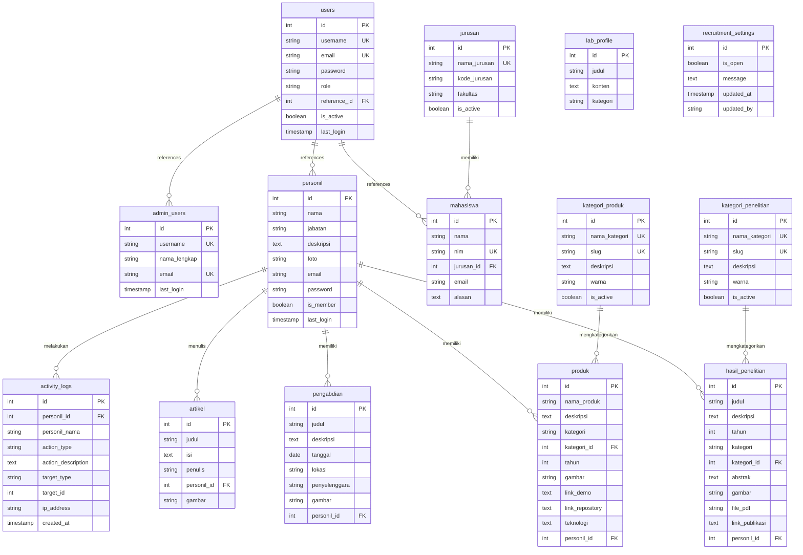

# Lab Software Engineering Website

Website resmi Laboratorium Software Engineering yang dibangun dengan PHP Native, PostgreSQL, dan Bootstrap 5. Sistem ini mencakup portal publik, manajemen admin, dashboard anggota (dosen/staff), dan area mahasiswa.

## 🎨 Fitur Utama

### 💫 Desain Modern & Responsif
- Interface modern menggunakan **Bootstrap 5** dengan animasi **AOS (Animate On Scroll)**
- Tata letak responsif yang optimal untuk semua perangkat (Desktop, Tablet, Mobile)
- Desain card-based dengan shadow dan hover effects
- Gradient backgrounds dan color schemes yang menarik

### 👥 Multi-Role Authentication System
- **Admin Area**: Kontrol penuh atas semua aspek website
  - Manajemen semua konten (Artikel, Penelitian, Pengabdian, Produk)
  - Manajemen user (Personil & Mahasiswa)
  - Pengaturan sistem dan monitoring
- **Member/Personil Area**: Dashboard personal untuk dosen/staff
  - Manajemen profil pribadi dengan foto dan biodata
  - CRUD portofolio mandiri (Penelitian, Pengabdian, Produk, Artikel)
  - Statistik kontribusi personal
- **Student Area**: Area khusus untuk mahasiswa
  - Profil mahasiswa
  - Akses informasi lab

### 📝 Manajemen Konten Dinamis
- **Landing Page Editor**: Admin dapat mengedit semua konten homepage
  - Hero Section (Judul, Deskripsi, Background)
  - About Section (Tentang Lab)
  - Vision & Mission (Visi & Misi)
  - Focus Areas (Area Fokus Penelitian)
- **Portofolio Management**: 
  - **Hasil Penelitian**: Judul, abstrak, kategori dinamis, tahun, file PDF, link publikasi
  - **Pengabdian Masyarakat**: Dokumentasi kegiatan pelatihan dan pengabdian
  - **Produk Hilirisasi**: Showcase produk Software/Hardware dengan kategori dinamis
- **Blog/Artikel System**: 
  - Editor artikel dengan upload gambar
  - Artikel terkait dengan personil sebagai penulis
  - Tampilan detail artikel dengan informasi penulis
- **Kategori Dinamis**:
  - Sistem manajemen kategori untuk penelitian dan produk
  - Badge berwarna untuk setiap kategori (customizable)
  - Filter konten berdasarkan kategori di halaman publik
  - Kategori dapat diaktifkan/nonaktifkan tanpa menghapus data

### 🎯 Fitur Khusus & Advanced

#### 🔄 Recruitment Toggle System
- Admin dapat membuka/menutup pendaftaran recruitment
- Custom message ketika recruitment ditutup
- Toggle otomatis menyembunyikan form dan button pendaftaran
- Tracking history perubahan (updated_by, updated_at)

#### 📊 Activity Log & Monitoring
- Real-time monitoring aktivitas personil
- Logging otomatis untuk:
  - Login/Logout events
  - CRUD Artikel (Create, Edit, Delete)
  - CRUD Penelitian (Create, Edit, Delete)
  - CRUD Pengabdian (Create, Edit, Delete)
  - CRUD Produk (Create, Edit, Delete)
- Filter & Search capabilities:
  - Filter berdasarkan personil
  - Filter berdasarkan jenis aktivitas
  - Filter berdasarkan tanggal
  - Pencarian keyword di deskripsi
- Pagination untuk performa optimal
- IP Address tracking

##### 🏷️ Kategori Dinamis (Dynamic Categories)
- **Kategori Penelitian**:
  - Manajemen kategori penelitian dengan warna badge kustom
  - Kategori default: Fundamental, Terapan, Pengembangan, Eksperimental, Studi Kasus
  - Filter penelitian berdasarkan kategori
  - Color-coded badges untuk identifikasi cepat
- **Kategori Produk**:
  - Sistem kategori produk yang dapat dikelola
  - Kategori default: Web Application, Mobile Application, IoT System, AI & Machine Learning, Desktop Application
  - Filter produk berdasarkan kategori
  - Badge warna untuk setiap kategori

### ⚡ Advanced Database Features
- **Materialized Views** untuk performa query dashboard yang cepat:
  - Dashboard Statistics (agregasi semua data)
  - Personil Contributions (ranking kontribusi)
  - Recent Activities (timeline aktivitas)
  - Yearly Research Summary (statistik penelitian per tahun)
  - Popular Content (konten terpopuler)
- **Stored Procedures** untuk operasi CRUD yang aman dan konsisten
- **Trigger Functions** untuk auto-update timestamp
- **Helper Functions** untuk kalkulasi score dan refresh views

### 🔐 Security Features
- Password hashing menggunakan bcrypt
- Session-based authentication dengan role validation
- SQL Injection protection dengan prepared statements
- CSRF protection untuk form submissions
- Validasi input server-side dan client-side

## 📁 Struktur Folder

```
labse_web/
├── admin/                   # Admin Area - Dashboard & Manajemen Sistem
│   ├── controllers/         # Controllers untuk CRUD operations
│   ├── includes/            # Admin header, footer, sidebar
│   ├── views/               # Admin view components
│   └── *.php                # Admin pages (dashboard, manage_*, activity_logs, dll)
│
├── member/                  # Member/Personil Area - Dashboard Personal
│   ├── controllers/         # Member CRUD controllers
│   ├── includes/            # Member header, footer, sidebar
│   └── *.php                # Member pages (dashboard, my_*, edit_*, add_*)
│
├── student/                 # Student Area - Area Mahasiswa
│   └── *.php                # Student pages dan features
│
├── views/                   # Public Views - Komponen Landing Page
│   ├── artikel/             # Artikel views (index, detail)
│   ├── penelitian/          # Penelitian views
│   ├── pengabdian/          # Pengabdian views
│   ├── produk/              # Produk views
│   ├── personil/            # Personil profile views
│   └── recruitment/         # Recruitment views
│
├── core/                    # Core System Files
│   └── database.php         # Database connection utility
│
├── includes/                # Global Includes
│   ├── config.php           # Database configuration
│   ├── header.php           # Public header
│   ├── footer.php           # Public footer
│   ├── navbar.php           # Public navigation
│   └── activity_logger.php  # Activity logging utility
│
├── assets/                  # Static Assets
│   ├── css/                 # Stylesheets
│   ├── js/                  # JavaScript files
│   └── img/                 # Images
│
├── uploads/                 # Upload Directory (File Storage)
│   ├── personil/            # Foto profil personil
│   ├── penelitian/          # Gambar & PDF penelitian
│   ├── pengabdian/          # Foto pengabdian
│   ├── produk/              # Gambar produk
│   └── artikel/             # Cover artikel
│
├── database/                # Database Schema & Migrations
│   ├── labse.sql            # Main database schema
│   ├── migrations/          # Migration files
│   ├── create_*.sql         # Table creation scripts
│   └── README_*.md          # Database documentation
│
├── public/                  # Public accessible files
│
├── index.php                # Landing Page Utama
├── login.php                # Halaman Login Terpusat (Multi-role)
└── README.md                # Dokumentasi Proyek (File ini)
```

## 🔑 Hak Akses & Modul

### 1. Public (Pengunjung)
- **Beranda**: Informasi umum lab, visi misi, roadmap.
- **Profil Lab**: Detail tentang laboratorium.
- **Personil**: Daftar dosen dan staff beserta profil lengkap.
- **Portofolio**: 
  - **Penelitian**: Daftar hasil penelitian dengan filter kategori dinamis dan color-coded badges
  - **Pengabdian**: Daftar kegiatan pengabdian masyarakat
  - **Produk**: Daftar produk hilirisasi dengan filter kategori dinamis dan badges
- **Blog**: Artikel dan berita terbaru dengan link ke profil penulis.
- **Recruitment**: Form pendaftaran anggota baru (jika dibuka).

### 2. Admin Area (`/admin`)
**Dashboard Utama**
- Statistik overview (Total Personil, Mahasiswa, Artikel, Penelitian, dll)
- Recent activities timeline
- Quick actions untuk manajemen konten

**Manajemen Pengguna**
- **Kelola Personil**:
  - Tambah/Edit/Hapus data personil (dosen/staff)
  - Upload foto profil
  - Manajemen jabatan dan biodata
  - Setting status member (enable/disable akses member area)
  - Generate password untuk member login
- **Kelola Mahasiswa**:
  - Lihat daftar mahasiswa yang mendaftar
  - Edit/Hapus data mahasiswa
  - View detail pendaftaran (NIM, Jurusan, Alasan)

**Manajemen Konten**
- **Artikel**: CRUD artikel (Admin dapat kelola semua artikel)
- **Hasil Penelitian**: CRUD penelitian untuk semua personil
  - Upload PDF dan gambar
  - Link ke publikasi jurnal/conference
  - Kategorisasi dinamis dengan badge berwarna
- **Pengabdian Masyarakat**: CRUD kegiatan pengabdian
  - Upload dokumentasi foto
  - Detail lokasi dan penyelenggara
- **Produk Hilirisasi**: CRUD produk hasil riset
  - Kategorisasi dinamis dengan badge berwarna
  - Link demo dan repository
  - Stack teknologi yang digunakan

**Manajemen Kategori Dinamis**
- **Kategori Penelitian**:
  - Tambah/Edit/Hapus kategori penelitian
  - Set warna badge untuk setiap kategori
  - Toggle status aktif/nonaktif kategori
  - View jumlah penelitian per kategori
- **Kategori Produk**:
  - Tambah/Edit/Hapus kategori produk
  - Customizable badge colors
  - Manajemen status kategori
  - View jumlah produk per kategori
- **Master Jurusan**:
  - CRUD data jurusan untuk mahasiswa
  - Mapping fakultas dan kode jurusan
  - Status aktif/nonaktif

**Manajemen Landing Page**
- Edit Hero Section (Judul, Subjudul, Deskripsi)
- Edit About Lab (Tentang Laboratorium)
- Edit Vision & Mission (Visi & Misi)
- Edit Focus Areas (Area Fokus Penelitian)
- Preview langsung sebelum publish

**Monitoring & Pengaturan**
- **Activity Logs**: 
  - Real-time monitoring aktivitas personil
  - Filter berdasarkan personil, jenis aktivitas, dan tanggal
  - Search functionality
  - Pagination (50 records per halaman)
  - Hapus log (bulk delete)
- **Recruitment Management**:
  - Toggle ON/OFF pendaftaran recruitment
  - Custom message ketika recruitment ditutup
  - Tracking history perubahan

### 3. Member Area (`/member`)
**Dashboard Personal**
- Statistik kontribusi pribadi (Total Penelitian, Pengabdian, Produk, Artikel)
- Recent activities (aktivitas terbaru)
- Quick access ke semua portofolio

**Profil Saya**
- Edit biodata lengkap (Nama, Jabatan, Deskripsi)
- Upload dan update foto profil
- Update email
- Change password
- Session logout otomatis untuk keamanan

**Portofolio Management**
- **Penelitian Saya**:
  - Tambah/Edit/Hapus penelitian pribadi
  - Upload PDF hasil penelitian
  - Upload gambar ilustrasi
  - Pilih kategori dari dropdown dinamis (Fundamental, Terapan, dll)
  - Link publikasi jurnal/conference
  - View detail penelitian
- **Pengabdian Saya**:
  - Tambah/Edit/Hapus kegiatan pengabdian
  - Upload foto dokumentasi
  - Detail tanggal, lokasi, penyelenggara
  - View detail pengabdian
- **Produk Saya**:
  - Tambah/Edit/Hapus produk hilirisasi
  - Pilih kategori dari dropdown dinamis (Web App, Mobile App, dll)
  - Upload gambar produk
  - Link demo dan repository
  - Stack teknologi
  - View detail produk

**Artikel Saya**
- Tulis artikel baru dengan editor
- Edit artikel pribadi
- Hapus artikel
- Upload gambar cover artikel
- Artikel otomatis linked ke profile personil

### 4. Student Area (`/student`)
- **Dashboard**: Informasi mahasiswa dan overview lab.
- **Profil**: Update data diri mahasiswa.
- **Interaksi**: Fitur komentar pada konten tertentu (dalam pengembangan).

## 🛠️ Teknologi yang Digunakan

### Backend
- **PHP Native** (7.4+) - Server-side scripting
- **PostgreSQL** (12+) - Relational Database Management System
- **pg_connect / pdo_pgsql** - PHP PostgreSQL extension

### Frontend
- **HTML5** - Markup structure
- **CSS3** - Styling dan animasi
- **Bootstrap 5** - Responsive framework
- **JavaScript (Vanilla)** - Client-side interactivity
- **AOS (Animate On Scroll)** - Scroll animations
- **Bootstrap Icons** - Icon library

### Database Features
- **Materialized Views** - Untuk query performa tinggi
- **Stored Procedures** - Business logic di database
- **Trigger Functions** - Auto-update dan logging
- **Foreign Key Constraints** - Data integrity dengan CASCADE

### Security
- **Password Hashing** - bcrypt algorithm
- **Session Management** - PHP native sessions
- **Prepared Statements** - SQL injection prevention
- **Input Validation** - Server-side & client-side

### File Management
- **File Upload System** - Untuk gambar dan PDF
- **Organized Storage** - Struktur folder terorganisir (`/uploads`)
- **Unique Filename Generation** - Anti konflik file

## 🚀 Instalasi & Konfigurasi

### Persyaratan Sistem
- PHP 7.4 atau lebih baru
- PostgreSQL 12 atau lebih baru
- Web Server (Apache/Nginx)

### Langkah Instalasi

1.  **Clone/Download Repository**
    Letakkan folder `labse_web` di direktori root web server Anda (misal: `C:\laragon\www\` atau `htdocs`).

2.  **Setup Database**
    - Buat database baru di PostgreSQL bernama `labse` (atau sesuai keinginan).
    - Import file SQL yang ada di folder `database/` (misal: `labse.sql` atau file dump terbaru).

3.  **Konfigurasi Koneksi**
    Buka file `includes/config.php` dan sesuaikan kredensial database:
    ```php
    define('DB_HOST', 'localhost');
    define('DB_PORT', '5432');
    define('DB_NAME', 'labse');
    define('DB_USER', 'postgres'); // User default PostgreSQL
    define('DB_PASS', 'password_anda');
    ```

4.  **Akses Website**
    Buka browser dan akses `http://localhost/labse_web`.

## 🛠 Troubleshooting

-   **Error Koneksi Database**: Pastikan service PostgreSQL berjalan dan kredensial di `config.php` benar. Pastikan ekstensi `pdo_pgsql` atau `pgsql` aktif di `php.ini`.
-   **Gambar Tidak Muncul**: Pastikan folder `uploads/` memiliki izin tulis (write permission) jika di lingkungan Linux/Unix.
-   **Halaman 404**: Cek konfigurasi `BASE_URL` jika ada, atau pastikan struktur folder tidak berubah.

## 🗄️ Struktur Database

Sistem ini menggunakan PostgreSQL sebagai database management system dengan struktur yang terorganisir untuk mendukung multi-role authentication dan manajemen konten.

### Tabel-Tabel Utama

#### 1. `users` - Tabel Autentikasi Pusat
Tabel ini berfungsi sebagai pusat autentikasi untuk semua pengguna sistem (admin, personil, dan mahasiswa).

**Kolom-kolom:**
- `id`: Primary key (auto-increment)
- `username`: Username unik untuk login
- `email`: Email unik pengguna
- `password`: Password terenkripsi (bcrypt)
- `role`: Role pengguna (`admin`, `personil`, `mahasiswa`)
- `reference_id`: ID referensi ke tabel asli sesuai role
- `is_active`: Status aktif pengguna (Boolean)
- `last_login`: Waktu login terakhir
- `created_at`, `updated_at`: Timestamp otomatis

#### 2. `admin_users` - Data Administrator
Menyimpan informasi lengkap administrator sistem.

**Kolom-kolom:**
- `id`: Primary key
- `username`: Username admin (unik)
- `nama_lengkap`: Nama lengkap admin
- `email`: Email admin (unik)
- `last_login`: Waktu login terakhir
- `created_at`, `updated_at`: Timestamp pembuatan

**Catatan:** 
- Password admin disimpan di tabel `users` (bukan di `admin_users`)
- Autentikasi menggunakan tabel `users` dengan `role = 'admin'`

#### 3. `personil` - Data Dosen/Staff (Member)
Menyimpan profil lengkap dosen dan staff laboratorium yang juga berfungsi sebagai member area.

**Kolom-kolom:**
- `id`: Primary key
- `nama`: Nama lengkap personil
- `jabatan`: Jabatan/posisi
- `deskripsi`: Deskripsi singkat atau bio
- `foto`: Path file foto profil
- `email`: Email personil
- `password`: Password untuk member login (nullable, deprecated - gunakan `users` table)
- `is_member`: Flag apakah personil aktif sebagai member (Boolean)
- `last_login`: Waktu login terakhir untuk member
- `created_at`, `updated_at`: Timestamp pembuatan

**Catatan:**
- Password member disimpan di tabel `users` dengan `role = 'personil'`
- `is_member = TRUE` mengindikasikan personil dapat login ke member area
- Kolom `password` masih ada untuk backward compatibility tapi tidak digunakan lagi

#### 4. `mahasiswa` - Data Mahasiswa
Menyimpan data mahasiswa yang mendaftar atau tergabung di laboratorium.

**Kolom-kolom:**
- `id`: Primary key
- `nama`: Nama lengkap mahasiswa
- `nim`: Nomor Induk Mahasiswa (unik)
- `jurusan`: Nama jurusan (string) - untuk backward compatibility
- `jurusan_id`: Foreign key ke tabel `jurusan` (ON DELETE SET NULL) - untuk relasi master data
- `email`: Email mahasiswa
- `alasan`: Alasan/motivasi bergabung
- `created_at`, `updated_at`: Timestamp pendaftaran

#### 5. `lab_profile` - Konten Landing Page
Menyimpan konten dinamis untuk berbagai section di landing page (About, Visi, Misi, Focus Area, dll).

**Kolom-kolom:**
- `id`: Primary key
- `judul`: Judul konten
- `konten`: Isi konten (TEXT)
- `kategori`: Kategori konten (`tentang`, `visi`, `misi`, `focus`)
- `created_at`: Timestamp pembuatan

#### 6. `artikel` - Artikel/Blog
Menyimpan artikel atau berita yang dipublikasikan oleh admin atau personil.

**Kolom-kolom:**
- `id`: Primary key
- `judul`: Judul artikel
- `isi`: Konten artikel (TEXT)
- `penulis`: Nama penulis (untuk display)
- `personil_id`: Foreign key ke tabel `personil` (ON DELETE SET NULL) - untuk link ke profil personil
- `gambar`: Path gambar cover artikel
- `created_at`, `updated_at`: Timestamp publikasi

#### 7. `hasil_penelitian` - Portofolio Penelitian
Menyimpan data hasil penelitian yang dilakukan oleh personil laboratorium.

**Kolom-kolom:**
- `id`: Primary key
- `judul`: Judul penelitian
- `deskripsi`: Deskripsi singkat
- `tahun`: Tahun penelitian
- `kategori`: Kategori penelitian (string) - untuk backward compatibility
- `kategori_id`: Foreign key ke `kategori_penelitian` (ON DELETE SET NULL) - untuk kategorisasi dinamis
- `abstrak`: Abstrak penelitian (TEXT)
- `gambar`: Path gambar ilustrasi
- `file_pdf`: Path file PDF hasil penelitian
- `link_publikasi`: Link ke publikasi jurnal/conference
- `personil_id`: Foreign key ke tabel `personil` (ON DELETE CASCADE)
- `created_at`, `updated_at`: Timestamp

#### 8. `pengabdian` - Portofolio Pengabdian Masyarakat
Menyimpan kegiatan pengabdian masyarakat dan pelatihan yang dilaksanakan.

**Kolom-kolom:**
- `id`: Primary key
- `judul`: Judul kegiatan pengabdian
- `deskripsi`: Deskripsi kegiatan (TEXT)
- `tanggal`: Tanggal pelaksanaan (DATE)
- `lokasi`: Lokasi kegiatan
- `penyelenggara`: Nama penyelenggara
- `gambar`: Path gambar dokumentasi
- `personil_id`: Foreign key ke tabel `personil`
- `created_at`, `updated_at`: Timestamp

#### 9. `produk` - Portofolio Produk Hilirisasi
Menyimpan produk hasil riset yang telah dihilirisasi (software atau hardware).

**Kolom-kolom:**
- `id`: Primary key
- `nama_produk`: Nama produk
- `deskripsi`: Deskripsi produk (TEXT)
- `kategori`: Kategori (`Software`, `Hardware`) - untuk backward compatibility
- `kategori_id`: Foreign key ke `kategori_produk` (relasi dinamis)
- `tahun`: Tahun pengembangan
- `gambar`: Path gambar produk
- `link_demo`: Link demo produk (jika ada)
- `link_repository`: Link GitHub/repository
- `teknologi`: Stack teknologi yang digunakan
- `personil_id`: Foreign key ke tabel `personil` (ON DELETE CASCADE)
- `created_at`, `updated_at`: Timestamp

#### 10. `recruitment_settings` - Pengaturan Recruitment
Menyimpan pengaturan pembukaan/penutupan recruitment dan pesan kustom.

**Kolom-kolom:**
- `id`: Primary key
- `is_open`: Status recruitment (Boolean) - TRUE = buka, FALSE = tutup
- `message`: Pesan yang ditampilkan ketika recruitment ditutup (TEXT)
- `updated_at`: Waktu terakhir update setting
- `updated_by`: Admin yang melakukan update terakhir

**Implementasi:**
- Admin dapat toggle recruitment on/off dari dashboard
- Custom message untuk tampilan saat recruitment ditutup
- History tracking siapa yang mengubah setting

#### 11. `activity_logs` - Log Aktivitas Personil
Menyimpan riwayat semua aktivitas personil untuk monitoring admin.

**Kolom-kolom:**
- `id`: Primary key
- `personil_id`: Foreign key ke `personil` (ON DELETE CASCADE)
- `personil_nama`: Nama personil (denormalisasi untuk performa)
- `action_type`: Jenis aktivitas (LOGIN, LOGOUT, CREATE_ARTICLE, dll)
- `action_description`: Deskripsi detail aktivitas (TEXT)
- `target_type`: Jenis target (artikel, penelitian, pengabdian, produk, profile)
- `target_id`: ID dari target yang dimanipulasi
- `ip_address`: IP address saat aktivitas dilakukan
- `created_at`: Timestamp aktivitas

**Jenis Aktivitas yang Dicatat:**
- Authentication: `LOGIN`, `LOGOUT`
- Artikel: `CREATE_ARTICLE`, `EDIT_ARTICLE`, `DELETE_ARTICLE`
- Penelitian: `CREATE_PENELITIAN`, `EDIT_PENELITIAN`, `DELETE_PENELITIAN`
- Pengabdian: `CREATE_PENGABDIAN`, `EDIT_PENGABDIAN`, `DELETE_PENGABDIAN`
- Produk: `CREATE_PRODUK`, `EDIT_PRODUK`, `DELETE_PRODUK`

#### 12. `kategori_penelitian` - Kategori Dinamis Penelitian
Menyimpan daftar kategori penelitian yang dapat dikelola oleh admin.

**Kolom-kolom:**
- `id`: Primary key
- `nama_kategori`: Nama kategori (unik)
- `slug`: URL-friendly slug (unik)
- `deskripsi`: Deskripsi kategori (TEXT)
- `warna`: Kode warna untuk badge (hex color)
- `is_active`: Status aktif kategori (Boolean)
- `created_at`, `updated_at`: Timestamp

**Kategori Default:**
- Fundamental (Blue - #0d6efd)
- Terapan (Green - #198754)
- Pengembangan (Yellow - #ffc107)
- Eksperimental (Purple - #6610f2)
- Studi Kasus (Red - #dc3545)

#### 13. `kategori_produk` - Kategori Dinamis Produk
Menyimpan daftar kategori produk yang dapat dikelola oleh admin.

**Kolom-kolom:**
- `id`: Primary key
- `nama_kategori`: Nama kategori (unik)
- `slug`: URL-friendly slug (unik)
- `deskripsi`: Deskripsi kategori (TEXT)
- `warna`: Kode warna untuk badge (hex color)
- `is_active`: Status aktif kategori (Boolean)
- `created_at`, `updated_at`: Timestamp

**Kategori Default:**
- Web Application (Blue - #0d6efd)
- Mobile Application (Purple - #6610f2)
- IoT System (Green - #198754)
- AI & Machine Learning (Yellow - #ffc107)
- Desktop Application (Red - #dc3545)

#### 14. `jurusan` - Master Data Jurusan
Menyimpan daftar jurusan untuk mahasiswa.

**Kolom-kolom:**
- `id`: Primary key
- `nama_jurusan`: Nama jurusan (unik)
- `kode_jurusan`: Kode singkatan jurusan
- `fakultas`: Nama fakultas
- `is_active`: Status aktif (Boolean)
- `created_at`, `updated_at`: Timestamp


### Relasi Antar Tabel

Database sistem ini memiliki struktur relasional yang kompleks dengan banyak tabel yang saling berhubungan. Untuk referensi lengkap, Anda dapat melihat Entity Relationship Diagram (ERD) lengkap di folder `database/`.

Berikut adalah diagram Entity Relationship dalam format Mermaid untuk memvisualisasikan hubungan utama antar tabel:



**Penjelasan Relasi:**

1. **Autentikasi Terpusat (`users`)**: 
   - Tabel `users` berperan sebagai pusat autentikasi yang menghubungkan semua role pengguna.
   - Kolom `role` menentukan jenis pengguna: `admin`, `personil`, atau `mahasiswa`.
   - Kolom `reference_id` menyimpan ID dari tabel asli sesuai role (ID dari `admin_users`, `personil`, atau `mahasiswa`).

2. **Kepemilikan Portofolio (One-to-Many)**:
   - Satu `personil` dapat memiliki banyak `hasil_penelitian` (relasi 1:N melalui `personil_id`).
   - Satu `personil` dapat memiliki banyak `pengabdian` (relasi 1:N melalui `personil_id`).
   - Satu `personil` dapat memiliki banyak `produk` (relasi 1:N melalui `personil_id`).
   - Satu `personil` dapat menulis banyak `artikel` (relasi 1:N melalui `personil_id`).
   - Jika personil dihapus, semua portofolio terkait juga akan terhapus (CASCADE DELETE).

3. **Kategori Dinamis**:
   - Relasi `kategori_penelitian` → `hasil_penelitian` (1:N) untuk kategorisasi penelitian
   - Relasi `kategori_produk` → `produk` (1:N) untuk kategorisasi produk
   - Menggunakan `kategori_id` untuk foreign key, dengan `kategori` (string) untuk backward compatibility

4. **Activity Logging**:
   - Relasi `personil` → `activity_logs` (1:N) untuk mencatat semua aktivitas personil
   - Menggunakan `target_type` dan `target_id` untuk referensi polymorphic ke berbagai tabel target

5. **Master Data**:
   - Relasi `jurusan` → `mahasiswa` (1:N) untuk mengkategorikan mahasiswa berdasarkan jurusan
   
6. **Konten Independen**:
   - Tabel `lab_profile` dan `recruitment_settings` bersifat independen (singleton)
   - Keduanya dikelola oleh admin untuk konten publik website.

### Implementasi Sistem

#### 1. Teknologi yang Digunakan
- **Backend**: PHP Native dengan ekstensi PostgreSQL (`pg_connect`, `pg_query`)
- **Database**: PostgreSQL 12+ dengan fitur SERIAL, TIMESTAMP, CASCADE
- **Autentikasi**: Session-based authentication dengan password hashing menggunakan `password_hash()` dan `password_verify()`
- **Query Protection**: Prepared statements dan `pg_escape_string()` untuk mencegah SQL Injection

#### 2. Pola Autentikasi Multi-Role

**Login Flow:**
1. User memasukkan username dan password di `login.php`
2. Sistem query tabel `users` berdasarkan username
3. Verifikasi password dengan `password_verify()`
4. Berdasarkan `role`, sistem mengambil data lengkap dari tabel referensi:
   - Jika `role = 'admin'`, ambil dari `admin_users` WHERE `id = reference_id`
   - Jika `role = 'personil'`, ambil dari `personil` WHERE `id = reference_id`
   - Jika `role = 'mahasiswa'`, ambil dari `mahasiswa` WHERE `id = reference_id`
5. Simpan data user ke session PHP
6. Redirect ke dashboard sesuai role:
   - Admin → `/admin/dashboard.php`
   - Personil → `/member/dashboard.php`
   - Mahasiswa → `/student/dashboard.php`

#### 3. Role-Based Access Control (RBAC)

Setiap folder area (`/admin`, `/member`, `/student`) memiliki file guard (`admin_guard.php`, `member_guard.php`, `student_guard.php`) yang:
- Memeriksa apakah user sudah login (session exists)
- Memvalidasi role user sesuai dengan area yang diakses
- Redirect ke login jika tidak authorized

**Contoh Guard:**
```php
// admin/includes/admin_guard.php
session_start();
if (!isset($_SESSION['user_id']) || $_SESSION['role'] !== 'admin') {
    header('Location: ../login.php');
    exit;
}
```

#### 4. Manajemen Portofolio Member

Member (Personil) dapat mengelola portofolio mereka sendiri melalui `/member` area:
- **Create**: Form untuk menambah penelitian/pengabdian/produk baru
- **Read**: Melihat daftar portofolio milik sendiri dengan query:
  ```sql
  SELECT * FROM hasil_penelitian WHERE personil_id = [current_user_reference_id]
  ```
- **Update**: Edit data portofolio milik sendiri
- **Delete**: Hapus portofolio milik sendiri

Admin memiliki akses penuh untuk mengelola semua data dari semua personil melalui `/admin` area.

#### 5. File Upload Management

File upload (foto, PDF, gambar) disimpan di folder `/uploads/` dengan struktur:
```
uploads/
├── personil/          # Foto profil personil
├── penelitian/        # Gambar & PDF penelitian
├── pengabdian/        # Foto kegiatan pengabdian
├── produk/            # Gambar produk
└── artikel/           # Cover artikel
```

Nama file di-generate unik menggunakan `time()` atau `uniqid()` untuk menghindari konflik.

#### 6. Security Features

- **Password Hashing**: Semua password disimpan dengan `password_hash($password, PASSWORD_DEFAULT)`
- **SQL Injection Protection**: Menggunakan `pg_escape_string()` dan parameterized queries
- **Session Management**: Session timeout dan regeneration untuk mencegah session hijacking
- **CSRF Protection**: Token validation untuk form submission (khususnya di admin area)
- **Input Validation**: Server-side validation untuk semua input form

## 🔍 Activity Log System

Sistem Activity Log memungkinkan admin untuk memonitor semua aktivitas personil secara real-time.

### Aktivitas yang Dilog

**Authentication Events:**
- `LOGIN` - Saat personil login
- `LOGOUT` - Saat personil logout

**Content Management:**
- Artikel: `CREATE_ARTICLE`, `EDIT_ARTICLE`, `DELETE_ARTICLE`
- Penelitian: `CREATE_PENELITIAN`, `EDIT_PENELITIAN`, `DELETE_PENELITIAN`
- Pengabdian: `CREATE_PENGABDIAN`, `EDIT_PENGABDIAN`, `DELETE_PENGABDIAN`
- Produk: `CREATE_PRODUK`, `EDIT_PRODUK`, `DELETE_PRODUK`

### Data yang Tersimpan
- Personil ID dan Nama
- Jenis aktivitas (action_type)
- Deskripsi detail aktivitas
- Target type dan ID (artikel/penelitian/dll)
- IP Address
- Timestamp

### Fitur Filter & Search
- Filter berdasarkan personil
- Filter berdasarkan jenis aktivitas
- Filter berdasarkan rentang tanggal
- Pencarian keyword di deskripsi
- Pagination untuk performa optimal

### Akses Activity Logs
Admin dapat mengakses Activity Logs melalui:
```
/admin/activity_logs.php
```

## ⚡ Advanced Database Features

Sistem ini dilengkapi dengan **Materialized Views** dan **Stored Procedures** untuk meningkatkan performa database.

### Materialized Views
1. `mv_dashboard_statistics` - Statistik dashboard yang cepat
2. `mv_personil_contributions` - Ranking kontribusi personil
3. `mv_recent_activities` - Timeline aktivitas terbaru
4. `mv_yearly_research_summary` - Statistik penelitian per tahun
5. `mv_popular_content` - Konten terpopuler

### Stored Procedures
- CRUD operations untuk Artikel, Penelitian, Pengabdian, Produk
- Get personil detail dengan semua kontribusi
- Dashboard statistics aggregation
- Content search engine
- Bulk delete operations

### Trigger Functions
- Auto-update `updated_at` timestamp
- Auto-logging aktivitas (optional)

### Cara Instalasi Advanced Features

**Metode Otomatis (Recommended):**
```bash
php database/migrations/run_advanced_migration.php
```

**Metode Manual:**
```bash
psql -U postgres -d labse
\i database/create_materialized_views.sql
\i database/create_stored_procedures.sql
\i database/create_trigger_functions.sql
```

### Refresh Materialized Views
```sql
-- Refresh semua views sekaligus
SELECT fn_refresh_all_materialized_views();

-- Atau refresh satu per satu
REFRESH MATERIALIZED VIEW mv_dashboard_statistics;
```

**Detail lengkap**: Lihat file `database/README_ADVANCED_FEATURES.md`

## 📚 Dokumentasi Tambahan

Untuk dokumentasi lebih detail, silakan lihat file-file berikut:

- **`database/README_ADVANCED_FEATURES.md`** - Panduan lengkap Materialized Views & Stored Procedures
- **`IMPLEMENTATION_GUIDE.md`** - Panduan implementasi sistem
- **`MEMBER_SETUP_GUIDE.md`** - Panduan setup member area
- **`FITUR_MANAJEMEN_USER.md`** - Panduan manajemen user
- **`SECURITY_FEATURES.md`** - Dokumentasi fitur keamanan
- **`admin/README_ADMIN.md`** - Panduan admin area
- **`member/README.md`** - Panduan member area

## 🚀 Roadmap & Future Improvements

- [ ] Dashboard analytics dengan charts/graphs
- [ ] Export data ke PDF/Excel
- [ ] Email notifications untuk aktivitas penting
- [ ] Advanced search dengan full-text search
- [ ] API endpoints untuk mobile app
- [ ] Multi-language support (EN/ID)
- [ ] Dark mode theme

## 📄 Lisensi

Proyek ini dikembangkan untuk **Laboratorium Software Engineering**. Silakan hubungi administrator lab untuk penggunaan lebih lanjut.

---

**Developed with ❤️ by Lab Software Engineering Team**  
**Last Updated**: 12 Desember 2024
